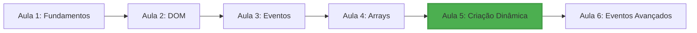

# 🚀 Aula 5: Criação Dinâmica de Elementos

<div align="center">


**Domine a criação dinâmica de elementos DOM com JavaScript**

[🎯 Objetivos](#-objetivos) • 
[📚 Conteúdo](#-conteúdo) • 
[🛠️ Como Usar](#️-como-usar) • 
[💻 Demonstrações](#-demonstrações) • 
[📝 Exercícios](#-exercícios) • 
[🧪 Testes](#-testes)

</div>

---

## 🎯 Objetivos

### 🎓 Objetivo Geral

Capacitar os alunos a criar e manipular elementos HTML dinamicamente usando JavaScript, desde técnicas básicas até conceitos avançados como Virtual DOM e sistemas de componentes.

### 🎯 Objetivos Específicos

* ✅ **Dominar** métodos de criação dinâmica: `createElement`,  `appendChild`,  `setAttribute`
* ✅ **Aplicar** técnicas de otimização: `DocumentFragment`,  `cloneNode`
* ✅ **Comparar** abordagens: `innerHTML` vs `createElement`
* ✅ **Implementar** sistemas de templates e componentes básicos
* ✅ **Compreender** conceitos de Virtual DOM e frameworks modernos
* ✅ **Desenvolver** componentes reutilizáveis para o projeto TODO List

---

## 📚 Conteúdo

### 📖 Módulos da Aula

1. **🔨 Fundamentos de Criação Dinâmica**
   - Métodos básicos: createElement, appendChild, setAttribute
   - innerHTML vs createElement
   - Estruturas hierárquicas

2. **⚡ Técnicas de Otimização**
   - DocumentFragment para performance
   - cloneNode para templates
   - Reutilização de elementos

3. **🧩 Sistemas de Templates**
   - Templates reutilizáveis
   - Sistema de substituição de variáveis
   - Componentização básica

4. **🚀 Conceitos Avançados**
   - Virtual DOM simplificado
   - Diff algorithm básico
   - Micro-frameworks

### 🔧 Tecnologias Abordadas

* **JavaScript ES6+**: Classes, arrow functions, destructuring
* **DOM API**: Métodos de criação e manipulação
* **Performance**: Otimizações e boas práticas
* **Padrões**: Componentização e reutilização

---

## 🛠️ Como Usar

### 📋 Pré-requisitos

* ✅ Conhecimento básico de JavaScript (Aulas 1-4)
* ✅ Compreensão de DOM e seletores
* ✅ Experiência com eventos básicos
* ✅ Familiaridade com arrays e objetos

### 🚀 Configuração Inicial

1. **Clone o repositório** (se ainda não tiver):

```bash
git clone https://github.com/seu-usuario/todo-list-js.git
cd todo-list-js
```

2. **Navegue para a Aula 5**:

```bash
cd curso/aula-05
```

3. **Abra os arquivos**:

```bash
# Visual Studio Code
code .

# Ou abra index.html no navegador
open index.html
# Windows: start index.html
# Linux: xdg-open index.html
```

### 📁 Estrutura dos Arquivos

```
aula-05/
├── 📄 index.html              # Interface principal com demonstrações
├── 🔧 codigo-progressivo.js   # Implementações e exemplos
├── 📝 exercicios.md          # Exercícios práticos (3 níveis)
├── 📋 plano-aula.md          # Plano pedagógico completo
├── 🧪 teste-progressivo.html  # Sistema de avaliação
└── 📖 README.md              # Esta documentação
```

### 🎮 Fluxo de Aprendizagem Recomendado

1. **📖 Leitura**: Comece com este README
2. **👀 Demonstração**: Abra `index.html` para ver exemplos
3. **💻 Prática**: Execute códigos em `codigo-progressivo.js`
4. **📝 Exercícios**: Complete atividades em `exercicios.md`
5. **🧪 Avaliação**: Teste conhecimentos em `teste-progressivo.html`
6. **👨‍🏫 Ensino**: Use `plano-aula.md` para estruturar aulas

---

## 💻 Demonstrações

### 🔨 1. Criação Básica de Elementos

```javascript
// Exemplo: Criar um botão dinamicamente
function criarBotao(texto, callback) {
    const botao = document.createElement('button');
    botao.textContent = texto;
    botao.className = 'btn btn-primary';
    botao.addEventListener('click', callback);
    return botao;
}

// Uso
const meuBotao = criarBotao('Clique aqui!', () => {
    alert('Botão clicado!');
});
document.body.appendChild(meuBotao);
```

### ⚡ 2. Otimização com DocumentFragment

```javascript
// Exemplo: Criar lista otimizada
function criarListaOtimizada(items) {
    const fragment = document.createDocumentFragment();
    const ul = document.createElement('ul');

    items.forEach(item => {
        const li = document.createElement('li');
        li.textContent = item;
        li.className = 'list-item';
        ul.appendChild(li);
    });

    fragment.appendChild(ul);
    return fragment;
}

// Uso - muito mais rápido para muitos elementos!
const lista = criarListaOtimizada(['Item 1', 'Item 2', 'Item 3']);
container.appendChild(lista);
```

### 🧩 3. Sistema de Templates

```javascript
// Exemplo: Template reutilizável
function criarCard(dados) {
    const template = document.createElement('div');
    template.className = 'card';
    template.innerHTML = `
        <div class="card-header">
            <h3>${dados.titulo}</h3>
        </div>
        <div class="card-body">
            <p>${dados.conteudo}</p>
            <button class="btn btn-primary">Ação</button>
        </div>
    `;
    return template;
}

// Uso com diferentes dados
const card1 = criarCard({
    titulo: 'Primeiro Card',
    conteudo: 'Conteúdo do primeiro card'
});
```

### 🚀 4. Componente Avançado

```javascript
// Exemplo: Componente com estado
class ComponenteTodo {
    constructor(container) {
        this.container = container;
        this.todos = [];
        this.render();
    }

    adicionar(texto) {
        const todo = {
            id: Date.now(),
            texto: texto,
            completo: false
        };
        this.todos.push(todo);
        this.render();
    }

    render() {
        // Limpar container
        this.container.innerHTML = '';

        // Criar estrutura
        const fragment = document.createDocumentFragment();

        this.todos.forEach(todo => {
            const item = this.criarItemTodo(todo);
            fragment.appendChild(item);
        });

        this.container.appendChild(fragment);
    }

    criarItemTodo(todo) {
        const div = document.createElement('div');
        div.className = `todo-item ${todo.completo ? 'completo' : ''}`;

        const checkbox = document.createElement('input');
        checkbox.type = 'checkbox';
        checkbox.checked = todo.completo;
        checkbox.onchange = () => this.marcarCompleto(todo.id);

        const texto = document.createElement('span');
        texto.textContent = todo.texto;

        const botaoRemover = document.createElement('button');
        botaoRemover.textContent = '❌';
        botaoRemover.onclick = () => this.remover(todo.id);

        div.appendChild(checkbox);
        div.appendChild(texto);
        div.appendChild(botaoRemover);

        return div;
    }

    marcarCompleto(id) {
        const todo = this.todos.find(t => t.id === id);
        if (todo) {
            todo.completo = !todo.completo;
            this.render();
        }
    }

    remover(id) {
        this.todos = this.todos.filter(t => t.id !== id);
        this.render();
    }
}

// Uso
const todoApp = new ComponenteTodo(document.getElementById('todo-container'));
todoApp.adicionar('Aprender createElement');
todoApp.adicionar('Dominar DocumentFragment');
```

---

## 📝 Exercícios

### 📚 Estrutura dos Exercícios

Os exercícios estão organizados em **3 níveis progressivos**:

#### 🟢 **Nível 1: Iniciante**

* Criação básica de elementos
* Hierarquia simples
* Listas dinâmicas
* Formulários básicos
* **Desafio**: Galeria de imagens

#### 🟡 **Nível 2: Intermediário**

* innerHTML vs createElement
* DocumentFragment e performance
* Sistema de templates
* Clonagem e reutilização
* **Desafio**: Tabela avançada

#### 🔴 **Nível 3: Avançado**

* Virtual DOM simplificado
* Sistema de componentes
* Micro-framework
* **Desafio**: Editor WYSIWYG

### 🎯 Como Fazer os Exercícios

1. **Abra**: `exercicios.md`
2. **Escolha**: Seu nível atual
3. **Leia**: Instruções cuidadosamente
4. **Code**: Implemente as soluções
5. **Teste**: Verifique no navegador
6. **Compare**: Com gabaritos fornecidos

### ⚡ Dicas de Estudo

* 💡 **Comece simples**: Domine o básico antes do avançado
* 🔄 **Pratique**: Repetição é a chave do aprendizado
* 🧪 **Experimente**: Teste variações do código
* 👥 **Colabore**: Discuta soluções com colegas
* 📚 **Consulte**: Use documentação MDN

---

## 🧪 Testes

### 📊 Sistema de Avaliação

O `teste-progressivo.html` oferece:

* ⏱️ **Timer**: 20 minutos para completar
* 📈 **Progresso**: Acompanhe seu avanço
* 🎯 **12 Questões**: Teoria + Prática
* 💡 **Dicas**: Ajuda quando necessário
* 📋 **Feedback**: Explicações detalhadas
* 🏆 **Resultado**: Pontuação e análise

### 🎮 Tipos de Questões

1. **🧠 Conceituais**: Compreensão teórica
2. **💻 Práticas**: Múltipla escolha com código
3. **⌨️ Código**: Implementação livre
4. **🏆 Desafios**: Projetos completos

### 📊 Critérios de Avaliação

* **🌟 Excelente** (80-100%): Domina criação dinâmica
* **👍 Bom** (60-79%): Compreende conceitos principais
* **📚 Estude mais** (0-59%): Revise e pratique

### 🔄 Como Usar o Teste

1. **Abra**: `teste-progressivo.html` no navegador
2. **Leia**: Cada questão cuidadosamente
3. **Responda**: No tempo disponível
4. **Teste**: Códigos práticos
5. **Revise**: Respostas ao final
6. **Melhore**: Áreas que precisam de atenção

---

## 🔗 Integração com o Curso

### 📈 Progressão do Curso



### 🔄 Conexões com Outras Aulas

#### ⬅️ **Vem de**: Aula 4 (Arrays e Dados)

* Arrays de objetos para renderização
* Métodos de array (map, filter, forEach)
* Manipulação de dados dinâmicos

#### ➡️ **Vai para**: Aula 6 (Eventos Avançados)

* Event delegation para elementos dinâmicos
* Eventos personalizados
* Interatividade avançada

### 🎯 Aplicação no Projeto TODO

A Aula 5 é **fundamental** para o projeto TODO List:

```javascript
// Como aplicar no TODO List
class TodoListApp {
    constructor() {
        this.todos = [];
        this.container = document.getElementById('todo-list');
    }

    // Usar createElement para novos TODOs
    criarTodoElement(todo) {
        const li = document.createElement('li');
        li.className = 'todo-item';
        li.dataset.id = todo.id;

        // Checkbox
        const checkbox = document.createElement('input');
        checkbox.type = 'checkbox';
        checkbox.checked = todo.completed;

        // Texto
        const texto = document.createElement('span');
        texto.textContent = todo.text;

        // Botão remover
        const botaoRemover = document.createElement('button');
        botaoRemover.innerHTML = '🗑️';

        li.appendChild(checkbox);
        li.appendChild(texto);
        li.appendChild(botaoRemover);

        return li;
    }

    // Usar DocumentFragment para múltiplos TODOs
    renderizarTodos() {
        const fragment = document.createDocumentFragment();

        this.todos.forEach(todo => {
            const elemento = this.criarTodoElement(todo);
            fragment.appendChild(elemento);
        });

        this.container.innerHTML = '';
        this.container.appendChild(fragment);
    }
}
```

---

## 🌟 Recursos Avançados

### 🧠 Conceitos Avançados Abordados

#### 🔄 **Virtual DOM**

```javascript
// Implementação básica de Virtual DOM
class VirtualDOM {
    constructor() {
        this.vdom = null;
        this.realDOM = null;
    }

    createElement(type, props, ...children) {
        return {
            type,
            props: props || {},
            children: children.flat()
        };
    }

    render(vnode) {
        if (typeof vnode === 'string') {
            return document.createTextNode(vnode);
        }

        const element = document.createElement(vnode.type);

        // Aplicar propriedades
        Object.keys(vnode.props).forEach(key => {
            element.setAttribute(key, vnode.props[key]);
        });

        // Adicionar filhos
        vnode.children.forEach(child => {
            element.appendChild(this.render(child));
        });

        return element;
    }
}
```

#### 🧩 **Sistema de Componentes**

```javascript
// Base para componentes reutilizáveis
class Component {
    constructor(props = {}) {
        this.props = props;
        this.state = {};
        this.element = null;
    }

    setState(newState) {
        this.state = {
            ...this.state,
            ...newState
        };
        this.update();
    }

    render() {
        throw new Error('render() deve ser implementado');
    }

    mount(parent) {
        this.element = this.render();
        parent.appendChild(this.element);
    }

    update() {
        if (this.element) {
            const newElement = this.render();
            this.element.parentNode.replaceChild(newElement, this.element);
            this.element = newElement;
        }
    }
}
```

### 📚 Recursos de Estudo Adicionais

#### 🌐 **Links Úteis**

* [MDN - createElement](https://developer.mozilla.org/docs/Web/API/Document/createElement)
* [MDN - DocumentFragment](https://developer.mozilla.org/docs/Web/API/DocumentFragment)
* [JavaScript.info - Modifying Document](https://javascript.info/modifying-document)
* [React Virtual DOM Explained](https://reactjs.org/docs/faq-internals.html)

#### 📖 **Leituras Recomendadas**

* "JavaScript: The Good Parts" - Douglas Crockford
* "Eloquent JavaScript" - Marijn Haverbeke (Capítulo 14: DOM)
* "You Don't Know JS: Up & Going" - Kyle Simpson

#### 🎥 **Vídeos Educativos**

* [DOM Manipulation Crash Course](https://www.youtube.com/watch?v=0ik6X4DJKCc)
* [Virtual DOM in 17 minutes](https://www.youtube.com/watch?v=BYbgopx44vo)
* [JavaScript DOM Tutorial](https://www.youtube.com/watch?v=H63dVFDuJDM)

---

## 🚀 Próximos Passos

### 📅 Preparação para Aula 6

* ✅ **Revisar**: Eventos básicos (click, submit, change)
* ✅ **Estudar**: Event delegation e propagation
* ✅ **Pensar**: Como melhorar interatividade do TODO
* ✅ **Praticar**: Manipulação de eventos em elementos dinâmicos

### 🎯 Metas de Aprendizagem

Após dominar esta aula, você será capaz de:
* 🏗️ Criar interfaces dinâmicas complexas
* ⚡ Otimizar performance com técnicas avançadas
* 🧩 Desenvolver componentes reutilizáveis
* 🚀 Compreender bases de frameworks modernos

### 🔮 Visão do Projeto Final

Com os conhecimentos desta aula, seu TODO List será capaz de:
* ✨ Criar novos TODOs dinamicamente
* 🔄 Atualizar interface em tempo real
* 📱 Ser responsivo e interativo
* 🚀 Ter performance otimizada

---

## 🤝 Contribuições

### 💡 Como Contribuir

* 🐛 **Issues**: Reporte problemas ou sugira melhorias
* 🔧 **Pull Requests**: Envie correções ou novas funcionalidades
* 📝 **Documentação**: Ajude a melhorar explicações
* 🎓 **Exercícios**: Contribua com novos desafios

### 👥 Comunidade

* 💬 **Discussões**: Use GitHub Discussions para dúvidas
* 🌟 **Stars**: Mostre seu apoio com uma estrela
* 🔄 **Fork**: Adapte o conteúdo para suas necessidades
* 📢 **Compartilhe**: Ajude outros desenvolvedores

---

## 📄 Licença

Este projeto está sob a licença MIT. Veja o arquivo `LICENSE` para mais detalhes.

---

<div align="center">

### ⭐ Se este conteúdo foi útil, considere dar uma estrela no repositório!

**Desenvolvido com ❤️ para a comunidade de desenvolvedores JavaScript**

[🔝 Voltar ao topo](#-aula-5-criação-dinâmica-de-elementos)

</div>
